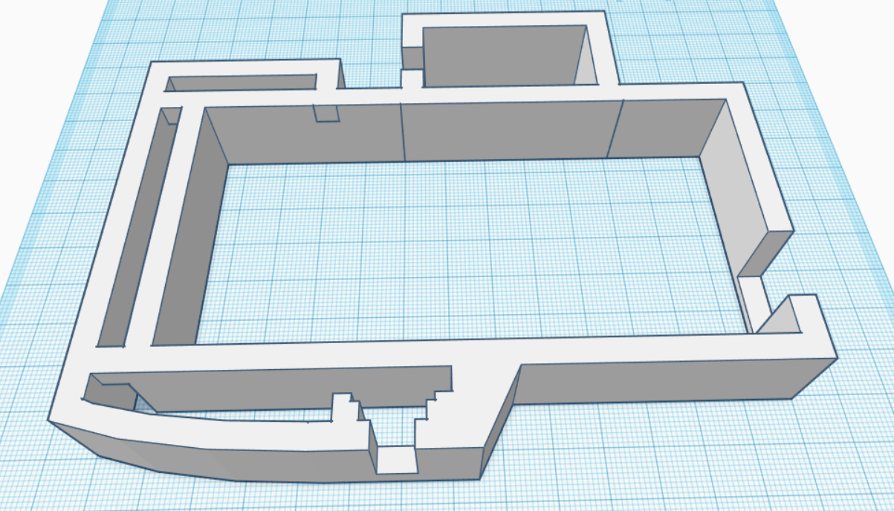
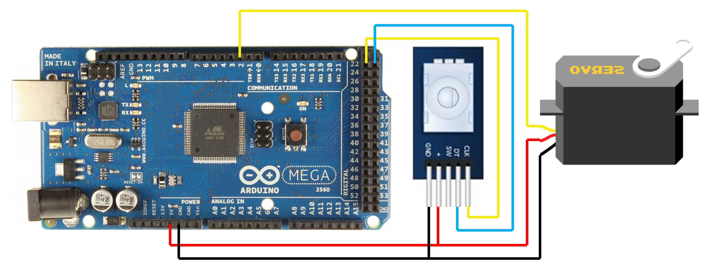

# Rotating-Sneaker-Display

## Table of Contents
- [Description](#Description)
- [Prerequisites](#Prerequisites)
- [How it Works](#How-it-Works)
- [Helpful Links](#Helpful-Links)

 

## Description
This rotating display supplemented the Capstone poster presentation for the [Nike Monitor][1] by attracting other students to inquire about the project. See it in action in the video below!

 

## Prerequisites
In order to build one for yourself, 
- [Arduino Microcontroller][3]
- [Motor][4]
- [Rotary Encoder][5]
- [Arduino IDE][6]

 

## How it Works
This project uses an Arduino Mega microcontroller to operate a motor and regulate it with a rotary encoder (like knobs used to control volume on car stereos). 

To make it presentable, I laser cut two ovals out of thin birch, one for the base and one for the platform. In addition, I 3D printed a [storage compartment][2] for the hardware and spray painted the whole thing white. All of this is *optional*.

 

 

Use the diagram below for assistance with wiring.

 

 

After that, download and open ***src/RotatingSneakerDisplay/RotatingSneakerDisplay.ino*** with the Arduino IDE, connect your microcontroller to the computer, and upload the program.

The platform will not spin initially - twist the rotary encoder to start the rotation. If the platform does not spin at all, double check the operating voltage of your motor. The maximum output voltage of the Arduino Mega is only 5 volts.

 

## Helpful Links
[Rotary Encoder Tutorial][7]

[Arduino Starter Kit][8]

[1]: https://github.com/Vladnet47/Nike-Monitor
[2]: ./model
[3]: https://store.arduino.cc/usa/mega-2560-r3
[4]: https://americas.rsdelivers.com/product/parallax-inc/900-00005/parallax-inc-140-ma-servo-motor-4-6-v/7813058?cm_mmc=US-PLA-DS3A-_-google-_-PLA_US_EN_CatchAll_New-_-Catch+All-_-PRODUCT_GROUP&matchtype=&pla-710096640604&gclid=EAIaIQobChMI08GWuN-V5wIVdRh9Ch3wbghiEAQYASABEgIg5PD_BwE&gclsrc=aw.ds
[5]: https://www.amazon.com/Maxmoral-Encoder-Degrees-Compatible-Development/dp/B07M631J1Q/ref=asc_df_B07M631J1Q/?tag=hyprod-20&linkCode=df0&hvadid=309795598953&hvpos=1o3&hvnetw=g&hvrand=13934315248319811334&hvpone=&hvptwo=&hvqmt=&hvdev=c&hvdvcmdl=&hvlocint=&hvlocphy=9033301&hvtargid=pla-634614360951&psc=1&tag=&ref=&adgrpid=61053849109&hvpone=&hvptwo=&hvadid=309795598953&hvpos=1o3&hvnetw=g&hvrand=13934315248319811334&hvqmt=&hvdev=c&hvdvcmdl=&hvlocint=&hvlocphy=9033301&hvtargid=pla-634614360951
[6]: https://www.arduino.cc/en/main/software
[7]: https://playground.arduino.cc/Main/RotaryEncoders/
[8]: https://www.amazon.com/EL-KIT-008-Project-Complete-Ultimate-TUTORIAL/dp/B01EWNUUUA/ref=sr_1_3?keywords=arduino+mega+kit&qid=1579594131&s=electronics&sr=1-3

